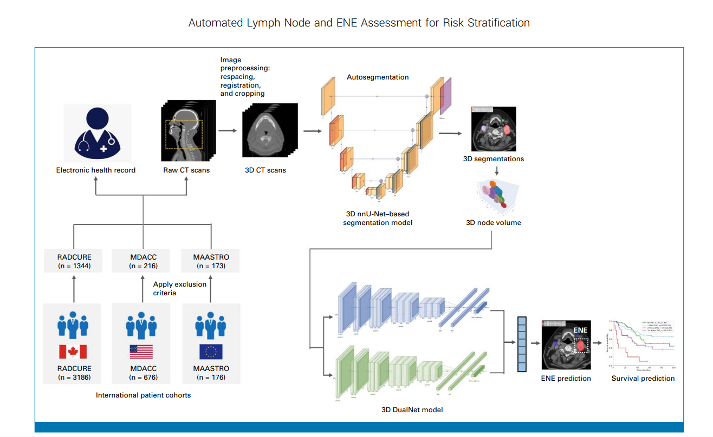

# Automated Lymph Node and Extranodal Extension Assessment Improves Risk Stratification in Oropharyngeal Carcinoma

**Abstract:** Extranodal extension (ENE) is a biomarker in oropharyngeal carcinoma (OPC) but can only be diagnosed via surgical pathology. We applied an automated artificial intelligence (AI) imaging platform integrating lymph node auto‑segmentation with ENE prediction to determine the prognostic value of the number of predicted ENE nodes. In a multisite, retrospective cohort of 1,733 OPC patients treated with definitive radiation therapy, malignant lymph nodes were segmented with a validated deep learning model, then processed with a validated ENE prediction model to compute the number of AI‑predicted ENE (AI‑ENE) nodes per patient. AI‑ENE node number was independently associated with poorer distant control and overall survival, and incorporating AI‑ENE into existing Radiation Therapy Oncology Group (RTOG‑0129) and AJCC 8th edition staging systems improved risk stratification, particularly among HPV‑negative patients. Automated AI‑ENE node number thus represents a novel risk factor for OPC that may better inform pretreatment risk stratification and decision making.




## Overview
This repository provides an end‑to‑end pipeline to:
- Ingest head‑and‑neck DICOM or NRRD/NIfTI, preprocess, and run nnU‑Net v1 segmentation of lymph nodes
- Classify per‑node ENE likelihood and node positivity with AI‑ENE.
- Produce a timestamped CSV of predictions and metrics.


## Environment Setup

### Option A: Conda (recommended)
```bash
# From inside AI_ENE/ create environment named ai-ene
conda env create -f environment.yml
conda activate ai-ene

# If PyTorch is not installed (or you want a specific build), install one:
# CPU-only:
#   pip install torch torchvision --index-url https://download.pytorch.org/whl/cpu
# CUDA 11.8 (if you have NVIDIA drivers/CUDA runtime):
#   pip install torch torchvision --index-url https://download.pytorch.org/whl/cu118

# Install local utils used by AI‑ENE (editable)
pip install -e ENE_inference/data-utils
```

### Option B: pip only
```bash
python -m venv .venv && source .venv/bin/activate
pip install -r requirements.txt

# Optional: pick a specific PyTorch build if needed (see above)
# Then install local utils
pip install -e ENE_inference/data-utils
```

Notes:
- CPU-only works by default. For GPU, install a CUDA‑compatible TensorFlow build or use Docker.
- nnU‑Net v1 (1.7.0) is used for segmentation; TensorFlow 2.11 for AI‑ENE classification.

## Downloads

- Download required assets from the shared folder: [Google Drive — AI_ENE assets](https://drive.google.com/drive/folders/1XGSU5Jc85SJu-s9vdGAp44LjZafH4tOD?usp=sharing)

- Shared folder structure:
  - AI_ENE/ENE_inference
    - ene_model
      - contains the ENE model file
    - nnunetfile
      - nnUNet_trained_model
      - reg_img_template

- After download, place them into this repository with the following layout:
  - `AI_ENE/ENE_inference/ene_model/0208-1531-1_DualNet.h5`
  
  - `AI_ENE/nnunet_segmentation/nnUNet_trained_model` (folder): should contain
    - `AI_ENE/nnunet_segmentation/nnUNet_trained_model/nnUNet/Task501_ENE/plans.pkl`
    - `AI_ENE/nnunet_segmentation/nnUNet_trained_model/nnUNet/Task501_ENE/fold_0/model_final_checkpoint.model`
    - `AI_ENE/nnunet_segmentation/nnUNet_trained_model/nnUNet/Task501_ENE/fold_0/model_final_checkpoint.model.pkl`

  - `AI_ENE/nnunet_segmentation/reg_img_template/template_image.nrrd`
    


## How to Run — End‑to‑End

### DICOM inputs
```bash
conda activate ai-ene
python run_e2e.py \
  --input-dir /abs/path/to/dicom_root \
  --input-format dicom \
  --output-dir output \
  --gpu cpu
```


 

### Non‑DICOM inputs (NRRD/NIfTI)
```bash
conda activate ai-ene
python run_e2e.py \
  --input-dir /abs/path/to/nifti_or_nrrd \
  --input-format nii.gz \
  --output-dir output \
  --gpu cpu
```
Notes (non‑DICOM):
- Allowed `--input-format`: `nrrd`, `nii`, `nii.gz` (case‑insensitive). If omitted, the value in `nnunet_segmentation/src/config.yaml` is used (defaults to `dicom`).
- You can also set `path.input_data_dir` and `data.input_data_format` in `nnunet_segmentation/src/config.yaml` instead of CLI.

### CLI options
- `--input-dir PATH`: unified input directory. If `--input-format dicom`, this is the DICOM root; otherwise it must contain NRRD/NIfTI. Takes precedence over legacy flags when provided.
- `--input-format {dicom|nrrd|nii|nii.gz}`: input modality. If omitted, uses `data.input_data_format` from `nnunet_segmentation/src/config.yaml` (default `dicom`).
- `--dicom-dir PATH` (legacy): DICOM input directory. Ignored when `--input-dir` is provided.
- `--input-data-dir PATH` (legacy): non‑DICOM input directory (NRRD/NIfTI). Ignored when `--input-dir` is provided.
- `--output-dir PATH`: base output directory for AI‑ENE results.
- `--gpu {cpu|auto|0}`: device selection (default: `cpu`). Use a CUDA‑enabled setup for GPU.
- `--include-short-axes`: compute short/long axis metrics and include them in the CSV.
- `--limit N`: maximum number of cases to process in the classification step (does not limit nnU‑Net preprocessing/segmentation).
- `--fg-labels {2|any|1,2}`: foreground label(s) in segmentation; `any` treats any nonzero voxel as foreground (default: `2`).


## Run with Docker (single image: GPU by default; CPU optional)

Build the image (from inside `AI_ENE/`):
```bash
docker build -t ai-ene:latest .
```

Run on GPU (default):
```bash
docker run --rm -it --gpus all \
  -v "/abs/path/to/your_dicom_root":/data/dicom \
  -v "$(pwd)":/app \
  -w /app \
  ai-ene:latest \
  --input-dir /data/dicom \
  --input-format dicom \
  --output-dir /app/output \
  --gpu 0
```

Run on CPU (override default):
```bash
docker run --rm -it \
  -v "/abs/path/to/your_dicom_root":/data/dicom \
  -v "$(pwd)":/app \
  -w /app \
  ai-ene:latest \
  --input-dir /data/dicom \
  --input-format dicom \
  --output-dir /app/output \
  --gpu cpu
```

Prerequisites for GPU on host:
- NVIDIA driver installed
- NVIDIA Container Toolkit installed (so Docker supports `--gpus all`)


Notes (classification on GPU):
- The Docker image includes a GPU-capable TensorFlow (2.13). Classification uses GPU when you run with `--gpus all` and pass `--gpu 0`.
- To force CPU classification, pass `--gpu cpu`.


## Benchmarking

AI-ENE includes benchmarking capabilities to compare performance against state-of-the-art models from HuggingFace's medical imaging leaderboards.

### Setup Benchmarking Dependencies

Install additional dependencies for benchmarking:
```bash
pip install transformers torch datasets huggingface-hub accelerate timm pillow
```

### Running Benchmarks

Basic benchmark run:
```bash
cd ENE_inference
python run_benchmark.py \
  --image-dir /path/to/test/images \
  --seg-dir /path/to/test/segmentations
```

With custom configuration:
```bash
python run_benchmark.py \
  --config benchmark_config.yaml \
  --image-dir /path/to/test/images \
  --seg-dir /path/to/test/segmentations \
  --max-cases 10
```

Specify HuggingFace models to compare:
```bash
python run_benchmark.py \
  --image-dir /path/to/test/images \
  --seg-dir /path/to/test/segmentations \
  --hf-models microsoft/swinv2-base-patch4-window12-192-22k facebook/sam-vit-base
```

### Benchmark Configuration

Edit `ENE_inference/benchmark_config.yaml` to customize:
- HuggingFace models to compare against
- Metrics to compute (Dice score, IoU, inference time, etc.)
- Output formats and reporting options
- Leaderboard tracking settings

### Benchmark Output

Results are saved in `benchmark_results/` and include:
- `benchmark_results_[timestamp].csv` - Detailed per-case results
- `benchmark_summary_[timestamp].json` - Summary statistics
- Performance comparison charts (when enabled)

### Tracked Metrics

- **Dice Score**: Overlap between predictions and ground truth
- **IoU (Intersection over Union)**: Segmentation accuracy
- **Sensitivity/Specificity**: Classification performance
- **Inference Time**: Speed comparison across models
- **Resource Usage**: Memory and GPU utilization

## Citation 

If you use this repository in your research, please cite the corresponding AI‑ENE paper.  

```text
Automated Lymph Node and Extranodal Extension Assessment Improves Risk Stratification in Oropharyngeal Carcinoma, https://ascopubs.org/doi/10.1200/JCO-24-02679
```

```bibtex
@article{TBD-ai-ene,
  title   = {TBD: Title of the AI-ENE paper},
  author  = {TBD},
  journal = {TBD},
  year    = {TBD}
}
```

## License 
CC BY-NC-ND 4.0

